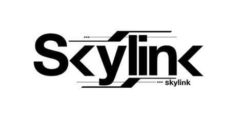

# SkyLink

A Virtual Event Platform built with NodeJs and Socket.IO.

Features:
 - TBA

## Usage
To install dependency:
`npm install`

To run app:
`node server`

Open your browser and go to:
`localhost:5000`

## Contributing
Pull requests are welcome. For major changes, please open an issue first to discuss what you would like to change.

## License
Distributed under the [MIT](https://choosealicense.com/licenses/mit/) License. See `LICENSE` for more information.
